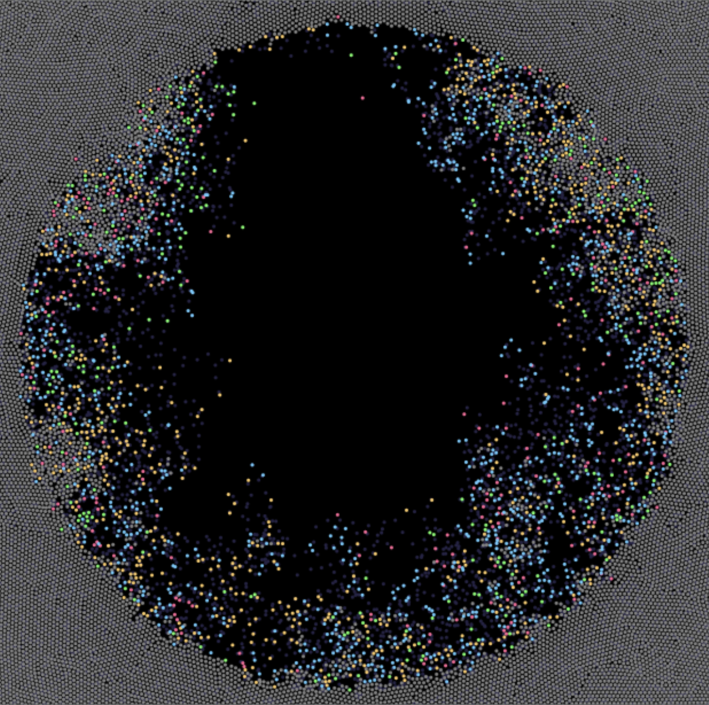
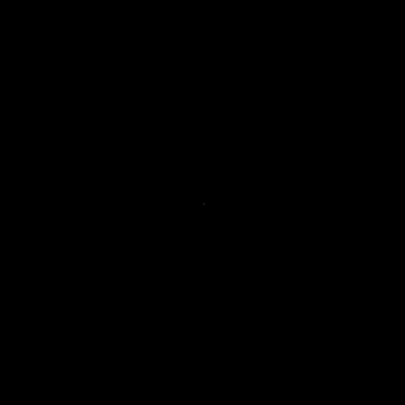
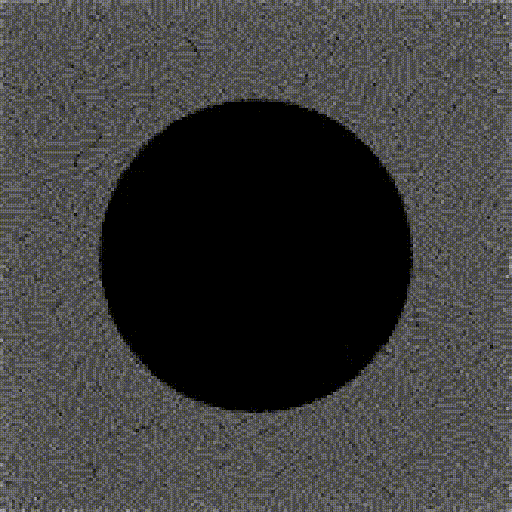
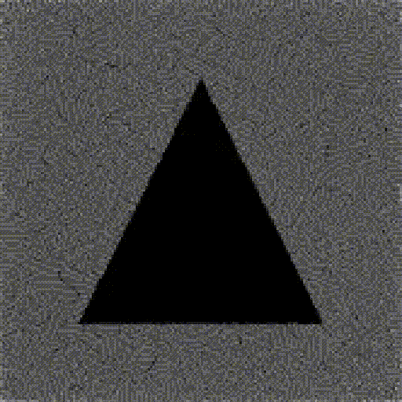
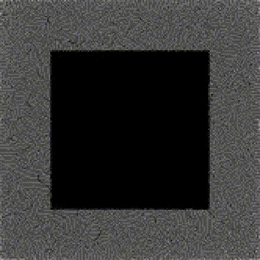
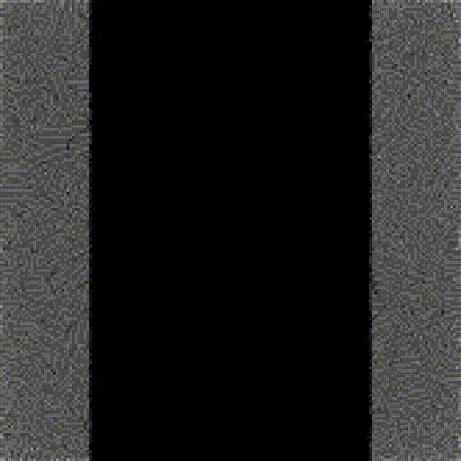
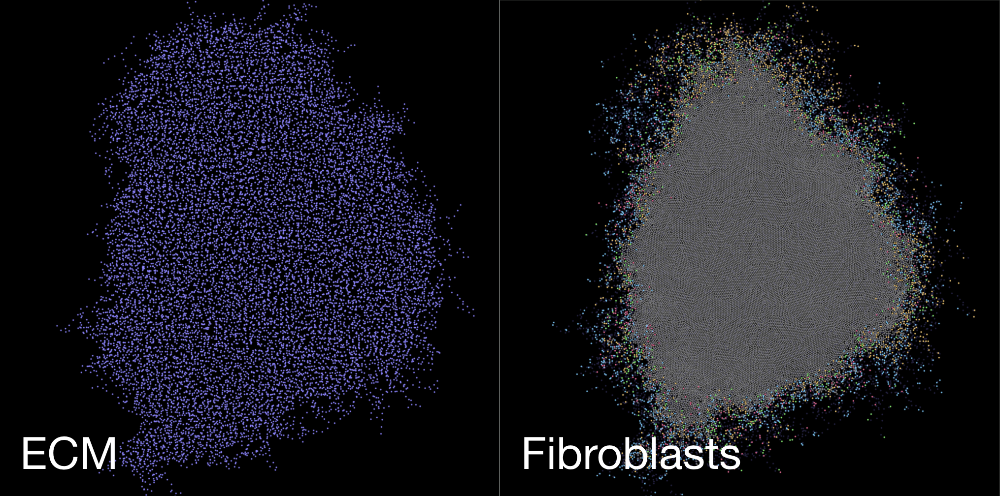

  

<h1 align="center">FISS: A Fibroblast In-Silico Simulator</h1>

  <em></em>

A Fibroblast migration and proliferation simulation to model Wound Healing, Gene Expression, and the Cell Cycle.
  
  Made by Rowan Sumanaweera. Project started in June 2025.

## Key Components

Fibroblasts:
* are represented by large colored circles 
* move along a random movement vector when not in G0
* go through the cell cycle (gray = G0, blue = G1, yellow = S, green = G2, red = M), and divide after M
* can exit the cell cycle and enter G0 if too crowded (Contact Inhibition) and can re-enter if the nearby cell density decreases
* occasionally deposit ECM (extra-cellular matrix) "particles" (represented by small purple circles)
* are repelled by ECM to encourage them to close wounds

## Related Figures
<table align="center">
  <tr>
    <td>
      
    </td>
    <td>
      
    </td>
    <td>
      
    </td>
    <td>
      
    </td>
    <td>
      
    </td>
  </tr>
</table>

<em>Various wound shape presets for scratch assay experiments.</em>

<em>ECM and Fibroblast growth at a given simulation step.</em>

## Current Task List

- [x] Research & Implement Verlet Integration
- [x] Draw Cells
- [x] Optimize with Spatial Partitioning
- [x] Allow for Appending and Removing Cells from Field
- [x] Add Cell Cycle
- [x] Add Contact Inhibition
- [x] Fix Border Cell Division
- [x] Add Graphing Tool
- [x] Add Deletion Tool
- [x] Implement Cell Cycle Stages
- [x] Tweak Contact Inhibition
- [x] Add Fibroblast Motility
- [x] Add Gene Expression
- [x] Add ECM Particles and ECM Behavior
- [x] Add Variable Cell Motion
- [x] Add Input Parameters TOML File
- [x] Add Deletion Shapes
- [x] Create Image Frame Capturer
- [x] Design Experimental Data Collection Methods
- [x] Begin Validation
- [ ] Write Paper
- [ ] Publish

## Tools
* **Space**: pause simulation
* **Right** click: create cell
* **Shift** + left click: delete cells within a specialized radius and shape (only while paused)
* **Alt**: save simulation state
* **Escape**: exit

Input your specialized experiment configuration in config.toml.

Find your saved simulation state in /savestates/

## Dependencies
The simulation was designed using python 3.9 and the following python packages: taichi 1.7.3, tomli 2.2.1, numpy 2.0.2, matplotlib 3.9.4, seaborn 0.13.2, and pandas 2.3.0.
